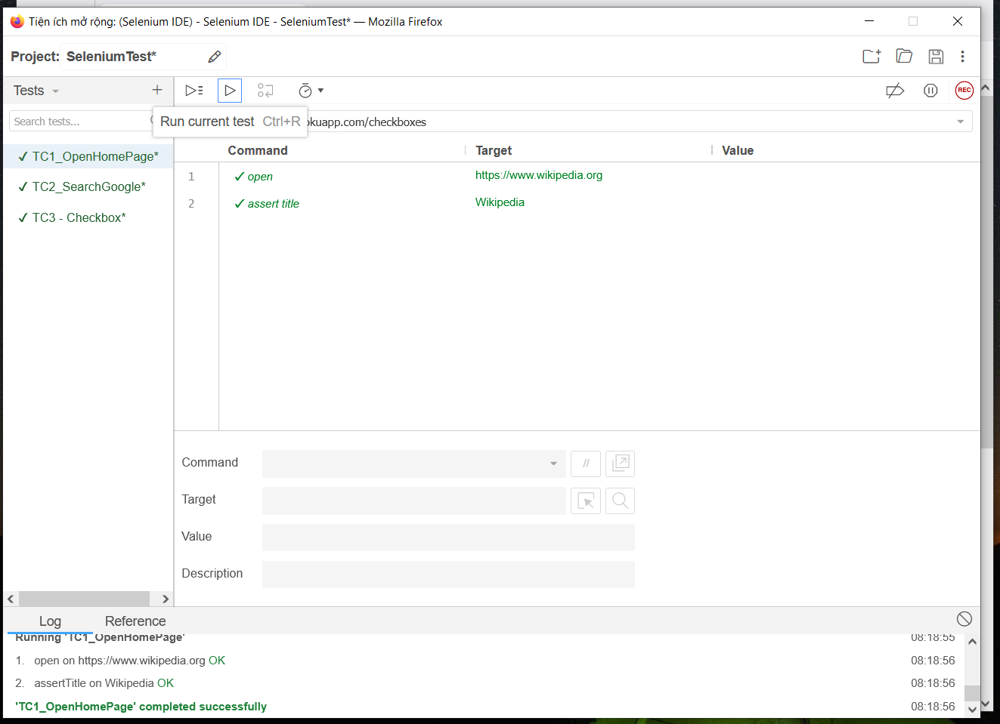
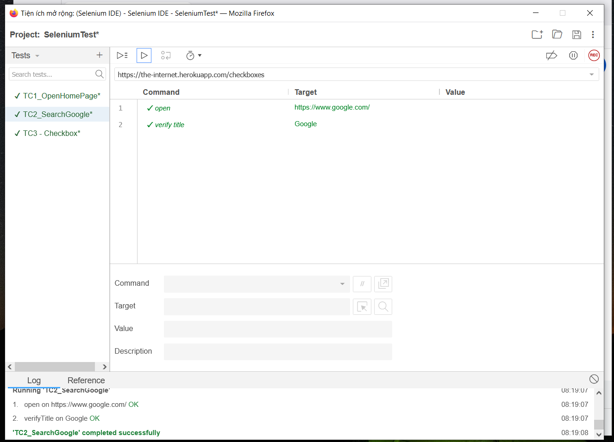
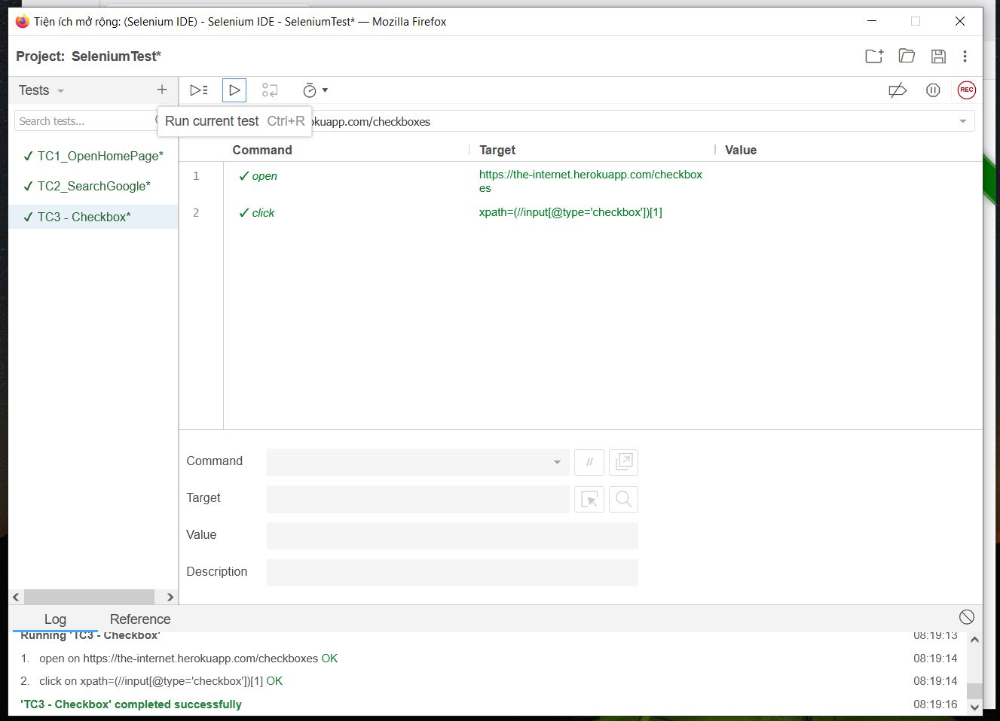

# SeleniumTest

## Giới thiệu

Selenium IDE là một công cụ kiểm thử tự động giúp ghi lại và thực thi các thao tác trên trình duyệt web. Công cụ này hỗ trợ người dùng tạo các kịch bản kiểm thử mà không cần phải lập trình phức tạp.

Trong bài thực hành này, Selenium IDE được sử dụng trên trình duyệt Firefox để xây dựng và thực thi các test case kiểm thử tự động cho một số website.

## Công cụ sử dụng

* Trình duyệt Mozilla Firefox
* Selenium IDE
* GitHub

## Các Test Case

### TC1 - Mở trang chủ Wikipedia

**Mục tiêu:** Kiểm tra khả năng truy cập trang chủ Wikipedia.

**Website:** https://www.wikipedia.org

#### Các bước thực hiện

1. Mở trang chủ Wikipedia.
2. Kiểm tra tiêu đề của trang.

#### Lệnh Selenium IDE

| Command     | Target                    |
| ----------- | ------------------------- |
| open        | https://www.wikipedia.org |
| assertTitle | Wikipedia                 |

#### Kết quả mong đợi

* Trang Wikipedia được mở thành công.
* Tiêu đề trang là "Wikipedia".

---

### TC2 - Mở trang chủ Google

**Mục tiêu:** Kiểm tra khả năng truy cập trang chủ Google.

**Website:** https://www.google.com

#### Các bước thực hiện

1. Mở trang chủ Google.
2. Kiểm tra tiêu đề của trang.

#### Lệnh Selenium IDE

| Command     | Target                 |
| ----------- | ---------------------- |
| open        | https://www.google.com |
| assertTitle | Google                 |

#### Kết quả mong đợi

* Trang Google được mở thành công.
* Tiêu đề trang là "Google".

---

### TC3 - Thao tác với Checkbox

**Mục tiêu:** Kiểm tra chức năng lựa chọn Checkbox trên website.

**Website:** https://the-internet.herokuapp.com/checkboxes

#### Các bước thực hiện

1. Mở trang Checkbox.
2. Chọn Checkbox đầu tiên.

#### Lệnh Selenium IDE

| Command | Target                                        |
| ------- | --------------------------------------------- |
| open    | https://the-internet.herokuapp.com/checkboxes |
| click   | xpath=(//input[@type='checkbox'])[1]          |

#### Kết quả mong đợi

* Checkbox đầu tiên được chọn thành công.

---

## Kết quả thực hiện

| Test Case                 | Kết quả |
| ------------------------- | ------- |
| TC1_OpenWikipediaHomePage | Passed  |
| TC2_OpenGoogleHomePage    | Passed  |
| TC3_CheckboxInteraction   | Passed  |

## Nhận xét

* Selenium IDE giúp tạo và thực thi các kịch bản kiểm thử một cách nhanh chóng.
* Giao diện trực quan, dễ sử dụng đối với người mới bắt đầu.
* Hỗ trợ kiểm thử các chức năng cơ bản của website như truy cập trang, kiểm tra tiêu đề và tương tác với các thành phần trên giao diện.

## Kết luận

Qua bài thực hành, đã tìm hiểu và sử dụng thành công Selenium IDE để xây dựng các kịch bản kiểm thử tự động. Ba test case đã được thực hiện thành công, bao gồm kiểm tra truy cập trang web và tương tác với thành phần Checkbox. Kết quả cho thấy Selenium IDE là một công cụ hiệu quả trong việc hỗ trợ kiểm thử phần mềm tự động.
